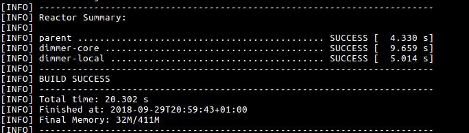
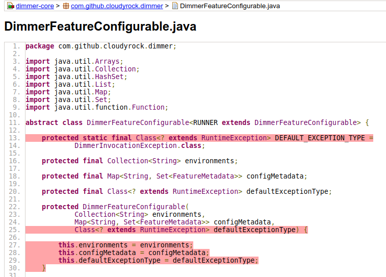

# Local verification process

## Table of contents

* [Introduction](#introduction)
* [First step: Verify what I've done](#first-step-verify-what-ive-done)
* [Results](#results)
   * [Success!](#success)
   * [Ooooops, something went wrong!](#ouups-something-went-wrong)
   * [What to do when verification fails?](#what-to-do-when-verification-fails)

## Introduction

This section will explain briefly how to verify the basic checks before submitting your pull request.

## First step: Verify what I've done

As explained, we expect your coverage to be at least 80% for unit and integration test.
You can check this by running `mvn clean verify` inside the project folder.

## Results

After running the performing the previous step, you might find different results:

### Success!

When the verification is successfully, you will see something like this

### Ooooops, something went wrong!

You can obviously get compilation errors or test failing, but we'll assume that you
already have the knowledge to deal with it. Lets focus on the actual verification,
which may fail if unit or integration tests fails for any of the submodules.

If this happens you will easily notice because at the end, maven will print somehting like :

As you can see, in the 10th last line, you see which step and submodule failed. In this case te verification fail in the
unit tests for mongock.

If you go a bit up, the only _WARNING_ message, you can see 80% coverage was expected, but 63% was provided instead.

### What to do when verification fails?

After retrieving the information about the failure(type of test and submodule), the next thing you should do is to  go to the Jacoco report and see which tests exactly you are missing.
Each submodule has its own  unit and integration html reports, which are located in `mongock/submodule/target/site/jacoco-ut/index.html`
and `mongock/submodule/target/site/jacoco-it/index.html` respectively.

If you open the report of the failure, you will see something like:

From there you can navigate to the classes and see what lines are not covered by tests.

